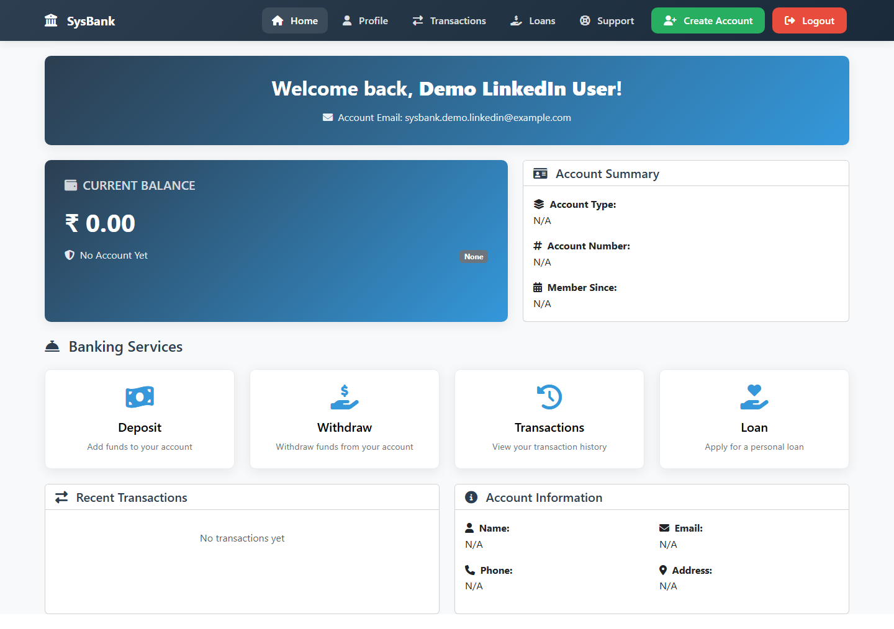
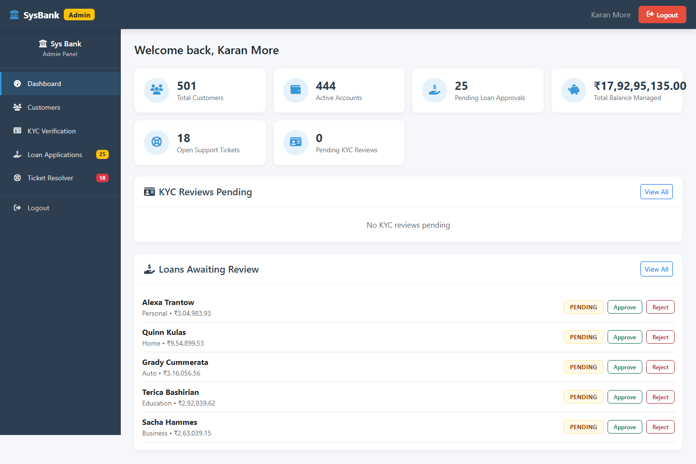

# 💳 SysBank — Online Banking Management System

A full-stack digital banking platform: a **Spring Boot REST API** backend paired with a **React** single-page frontend, backed by **MySQL**. Users manage accounts, deposits, withdrawals, transfers, and loans; admins review KYC documents, approve/reject loans, and monitor the system from a dedicated admin panel.

The legacy Thymeleaf server-rendered pages have been retired in favor of the React SPA, which talks to the backend purely over a JWT-secured REST API.

---

## 📸 Screenshots

| | |
|---|---|
| **Landing page** |  |
| **Login** |  |
| **User dashboard** |  |
| **Loan products** |  |
| **Admin panel** |  |
| **Create account** |  |

---

## 🚀 Features

### 👤 User
- Registration and secure JWT-based login/logout
- Account dashboard with balance and account summary
- Deposit funds via Razorpay, withdraw funds
- Fund transfers between accounts
- Apply for and track loans across multiple products (personal, auto, home, education)
- Full transaction history
- Support tickets

### 🔐 Admin
- JWT-secured admin panel, auto-assigned to a designated admin email
- Approve or reject loan applications
- Review and approve/reject KYC documents for new account sign-ups
- Monitor customers, active accounts, total balance managed, and open support tickets
- Resolve support tickets

### 🔒 Security
- Spring Security with JWT authentication on all protected endpoints
- Password hashing with BCrypt (lazy hash-on-login migration for legacy accounts)
- Account lockout after repeated failed login attempts
- Server-side validation (Bean Validation / Hibernate Validator)

---

## 🛠️ Tech Stack

**Backend**
- Java 25, Spring Boot 3.4 (Spring MVC, Spring Security, Spring Data JPA)
- Hibernate / JPA over MySQL 8
- JWT auth (`jjwt`)
- Razorpay Java SDK (payments)
- Spring Mail (Gmail SMTP notifications)
- Datafaker (demo data seeding)

**Frontend**
- React 19 + React Router 7
- Vite
- Axios
- Bootstrap 5

**Infra**
- Docker (multi-stage build)
- Deployed via Render (backend) + Vercel (frontend)

---

## 🏗️ Project Structure

```
BankManagement/
├── src/main/java/com/example/BankManagement/   # Spring Boot backend
│   ├── Controller/api/                         # REST controllers
│   ├── Entity/                                 # JPA entities
│   ├── Security/                                # JWT filter, security config
│   └── Service/                                 # Business logic
├── frontend/                                    # React + Vite SPA
│   └── src/
│       ├── pages/                               # Route-level pages
│       ├── components/                          # Shared UI components
│       └── api/                                 # Axios client
├── docs/screenshots/                            # README screenshots
└── Dockerfile                                   # Backend container build
```

---

## ⚙️ Setup

### Prerequisites
- Java 25 (JDK)
- Node.js + npm
- MySQL 8 running locally (or reachable via `DB_URL`)

### Backend

```bash
# from the repo root
cp src/main/resources/application.properties.example src/main/resources/application.properties
```

Set these environment variables (or edit the properties file for local dev only — never commit real values):

| Variable | Purpose |
|---|---|
| `DB_URL`, `DB_USERNAME`, `DB_PASSWORD` | MySQL connection (defaults to `jdbc:mysql://localhost:3306/bankdb`) |
| `JWT_SECRET` | Random ≥32-byte secret for signing JWTs |
| `MAIL_USERNAME`, `MAIL_PASSWORD` | Gmail SMTP + [app password](https://myaccount.google.com/apppasswords) for notifications |
| `RAZORPAY_KEY_ID`, `RAZORPAY_KEY_SECRET` | From the [Razorpay dashboard](https://dashboard.razorpay.com/app/keys) |
| `ADMIN_EMAIL` | The account with this email is auto-promoted to `ADMIN` on every startup |

```bash
./mvnw spring-boot:run
```

The API starts on `http://localhost:8080`.

### Frontend

```bash
cd frontend
cp .env.example .env   # sets VITE_API_BASE_URL=http://localhost:8080
npm install
npm run dev
```

The app starts on `http://localhost:5173`.

### Docker (backend only)

```bash
docker build -t sysbank-backend .
docker run -p 8080:8080 --env-file .env sysbank-backend
```

---

## 🔑 Admin access

The account whose email matches the `ADMIN_EMAIL` environment variable (`admin.designated-email` property, resolved by `AdminRoleEnforcer` into `Role` at startup) is automatically promoted to `ADMIN` on every boot. Set `ADMIN_EMAIL` in every deployed environment — if it's unset, no account gets promoted (local dev falls back to a placeholder in `application.properties.example`; the real, gitignored `application.properties` keeps its own local fallback).
